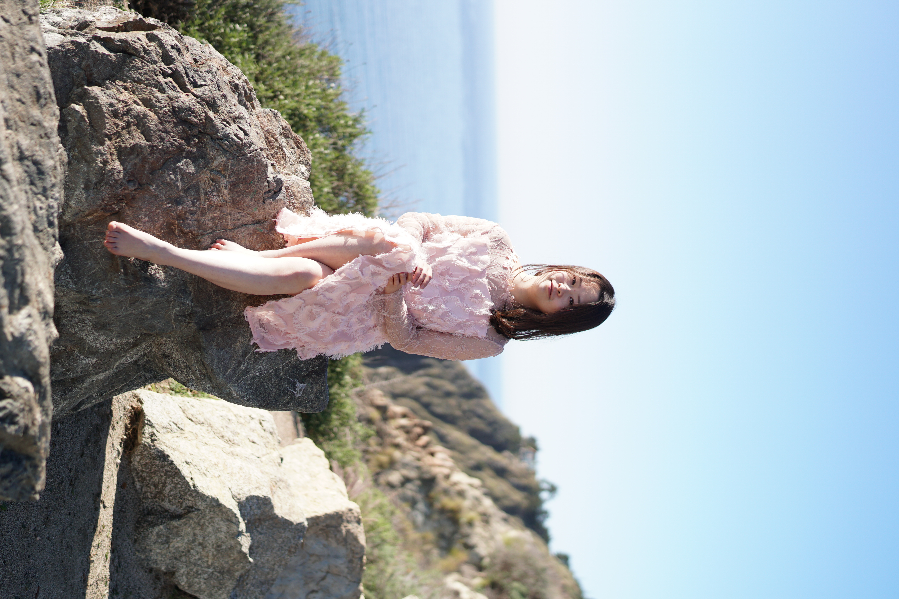

Welcome to my personal website! I graduated with a PhD degree from  [Media Lab](https://www.media.mit.edu/) at Massachusetts Institute of Technology. I study neurotechnology under the supervision of [Dr. Ed Boyden](http://syntheticneurobiology.org/people/display/71/11) and [Dr. Joseph Jacobson](https://www.media.mit.edu/people/jacobson/projects/). By developing tools for mapping the biomolecules in the brain, I hope we can have a deeper understanding our mind. Prior to graduate school, I was a visiting student in [Dr. Kay Tye's lab](https://tyelab.org/) studying the neural mechanism of social dominance.

My training in neuroscience shows me the power of eliciting emotion and thoughts with well-designed visual and audio stimuli (especially on mice hahahah). I have been an film director since 2015, such as [*Undefined Youth*](https://www.youtube.com/watch?v=oaaCXuzaxoY&list=PL6rJy6NYiBpxBIsRf6MWw5aUjJ9Z0UMFE&index=1&pp=iAQB), [*Memory Cut Pro*](https://www.youtube.com/watch?v=UcbXHZFgT5g&list=PL6rJy6NYiBpxBIsRf6MWw5aUjJ9Z0UMFE&index=2), [*My Poetic AlphaFriend*](https://www.youtube.com/watch?v=VLWN5po2utQ&list=PL6rJy6NYiBpxBIsRf6MWw5aUjJ9Z0UMFE&index=4), [*Decode MIT*](https://www.youtube.com/watch?v=uHGVZoZ4KLg), [*Robotic Dog Finding me a Girlfriend*](https://www.youtube.com/watch?v=LqRdht7AoTA). [Watching my films](https://ruihanzhang2015.github.io/film/) is the best way to learn my view of the world and personality :-D

At MIT, I founded the [MIT Film Makers Assocation](https://engage.mit.edu/fma/home/) in the hope to get my fellow MIT friends interested in expressing themselves and resonating with other souls across space and time. I organized the [first MIT AI for filmmaking hackathon](https://www.media.mit.edu/posts/mit-ai-for-filmmaking-hackathon-2023-brings-dreams-to-life/) and [the second iteration](https://engage.mit.edu/fma/about/). Hundreds of people participated in our hackathon, and we received sponsorship from top-tier startups. I was honored to co-organized the [Generative AI for visual arts workshop at CVPR 2024](https://cveu.github.io/).

Feel free to contact me if you are interested in learning more, email me at [ruihanzhang2015@gmail.com](mailto:ruihanzhang2015@gmail.com) or message me on [Instagram(@ruihanzhang2015)](https://www.instagram.com/ruihanzhang2015/?hl=en), or via [LinkedIn](https://www.linkedin.com/in/ruihan-zhang-45b434150/)

{: .align-center; width="50%"}
